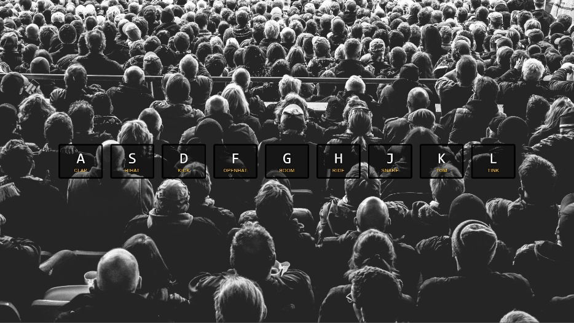

# JS Drum Kit

This is a simple JavaScript Drum Kit project that allows users to play drum sounds using keyboard keys.

[Click here to watch the video demo with sound](JS-Drum-Kit-Live-Demo.mp4)

## Features

- Play drum sounds by pressing corresponding keyboard keys.
- Visual feedback when playing each drum sound.
- Sounds include clap, hihat, kick, openhat, boom, ride, snare, tom, and tink.

## Getting Started

To get started with the project, follow these steps:

1. Clone the repository: `https://github.com/NTracey/JS-Drum-Kit.git`
2. Open `index.html` in your preferred web browser.

## Usage

- Press the keyboard keys A, S, D, F, G, H, J, K, or L to play different drum sounds.
- Each drum sound is associated with a specific key as indicated on the screen.

## Technologies Used

- HTML5
- CSS3
- JavaScript

## Credits

- This project is inspired by Wes Bos's JavaScript 30 course.